# AI-Native DevSecOps

## From Shift-Left to Agent-In-the-Loop

<div class="pt-12">
  <span class="px-2 py-1">
    Computer Security Seminar
  </span>
</div>

<div class="abs-br m-6 flex gap-2">
  <span class="text-sm opacity-50">June 2026</span>
</div>

<!--
Welcome. Today we explore how AI agents are changing the security landscape in software development.
-->

---
layout: default
---

# Why DevSecOps?

<v-clicks>

- **Supply chain attacks up 742%** since 2019
- **70-90% of modern code** is third-party dependencies
- "Scan at the end" fails at modern velocity
- Security must be **automated, continuous, embedded**

</v-clicks>

<!--
The threat landscape has fundamentally changed. You can't bolt security on at the end anymore.
-->

---
layout: default
---

# The Evolution

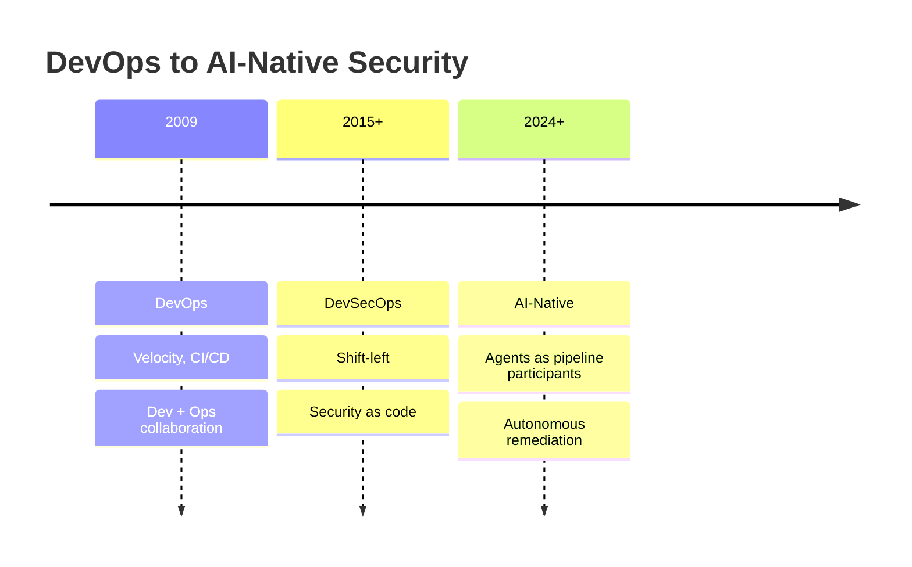

<v-click>

> Each step: **higher abstraction**, **more automation**, **new risks**

</v-click>

<!--
This isn't just a naming change. Each evolution introduces new attack surfaces.
-->

---
layout: default
---

# Standards Landscape

<div class="grid grid-cols-2 gap-6 text-sm">
<div>

### Application Security
<v-clicks>

- OWASP Top 10 (2025)
- CWE Top 25

</v-clicks>

### Supply Chain
<v-clicks>

- SLSA Framework
- SBOM Mandates (EO 14028, EU CRA)

</v-clicks>
</div>
<div>

### AI/ML Security
<v-clicks>

- OWASP LLM Top 10 (2025)
- NIST AI RMF
- MITRE ATLAS

</v-clicks>

### Framework & Adversary Modeling
<v-clicks>

- NIST CSF 2.0
- MITRE ATT&CK

</v-clicks>
</div>
</div>

<!--
These standards aren't academic — they're compliance requirements. Let's see how they map to real practices.
-->

---

# Concept — Software Composition Analysis (SCA)

<v-clicks>

- **What**: scanning third-party dependencies for known CVEs
- **Why**: 70-90% of your codebase is not yours
- **What can go wrong**:
  - Vulnerable transitive dependencies (you depend on a dependency that depends on a vulnerable package)
  - License violations (GPL in proprietary code)

</v-clicks>

<!--
SCA is your first line of defense. You can't protect what you don't know you have.
-->

---

# SCA — Tools by Environment

<div class="grid grid-cols-2 gap-6">
<div>

### Local / IDE
<v-clicks>

- **Snyk plugin** — real-time inline scanning
- **OSV-Scanner** — local scan, Google-backed

</v-clicks>
</div>
<div>

### CI Pipeline
<v-clicks>

- **OWASP Dependency-Check** — CVSS gating (fail at ≥7.0)
- **Snyk CI** — cloud-backed, developer-first
- **Grype** — SBOM-native cross-check
- **Trivy** — multi-purpose scanner

</v-clicks>
</div>
</div>

<!--
No single tool catches everything. Layer them.
-->

---

# Concept — Secret Scanning

<v-clicks>

- **What**: detecting hardcoded credentials in source code
- **Why**: secrets in git = **permanent exposure**, even after deletion
- **Two approaches**:
  - **Regex patterns** — match known formats (AWS keys, API tokens)
  - **Entropy detection** — find high-randomness strings that look like secrets

</v-clicks>

<!--
One leaked AWS key can compromise your entire infrastructure. Pre-commit hooks are your cheapest defense.
-->

---
layout: default-note
---

# Secret Scanning — Tools by Environment

<div class="grid grid-cols-2 gap-6">
<div>

### Local / IDE
<v-clicks>

- **Gitleaks** — pre-commit hook, most common for local use

</v-clicks>
</div>
<div>

### CI Pipeline
<v-clicks>

- **TruffleHog** — entropy-based, 700+ detectors
- **MOJ Scanner** — custom regex patterns

</v-clicks>
</div>
</div>

::note::

<v-click>

> Local catches **before commit**. CI catches **what slips through**. Complementary.

</v-click>

<!--
Pre-commit is cheapest. CI is defense-in-depth. Never rely on just one.
-->

---
layout: center
class: text-center
---

# Prevention > Detection

<div class="text-xl opacity-80 mt-4">

"The cheapest vulnerability to fix is the one you never write"

</div>

<!--
This is the core argument of shift-left. Let's unpack it.
-->

---
layout: default-note
---

# Prevention > Detection

<v-clicks>

- **Shifting left** means catching issues at authoring, not at merge
- **Deterministic controls** (linters, type systems) prevent entire classes of bugs
- AI agents should **generate secure code**, not generate vulnerable code for scanners to catch
- The pipeline is a **safety net**, not a crutch

</v-clicks>

::note::

<v-click>

> **Implication**: invest in IDE/local controls first, CI as defense-in-depth

</v-click>

<!--
If you're spending most of your security budget on CI scanning, you're investing in the wrong place.
-->

---

# Concept — Static Application Security Testing (SAST)

<v-clicks>

- **What**: analyzing source code for vulnerability patterns **without execution**
- **Why**: catches bugs at authoring, before runtime
- **Two approaches**:
  - **Semantic analysis** — deep, slow (tracks data flow across functions)
  - **Pattern matching** — fast, shallow (matches known bad patterns)

</v-clicks>

<!--
SAST is the "compile-time" of security. It catches structural problems.
-->

---
layout: default-note
---

# SAST — Tools by Environment

<div class="grid grid-cols-2 gap-6">
<div>

### Local / IDE
<v-clicks>

- **Semgrep** — pattern-based, fast, custom rules, 30+ languages
- **ESLint security plugins** — rule-based, language-specific
- **SonarLint** — inline IDE scanning

</v-clicks>
</div>
<div>

### CI Pipeline
<v-clicks>

- **CodeQL** — semantic, dataflow + taint tracking, 10+ languages
- **Semgrep CI** — fast pattern matching at scale

</v-clicks>
</div>
</div>

::note::

<v-click>

> **Note**: Semgrep is 10-50x faster than CodeQL but can't track taint across functions. **Complementary.**

</v-click>

<!--
Use Semgrep for fast feedback, CodeQL for deep analysis. Different layers of the same defense.
-->

---

# Concept — Software Bill of Materials (SBOM)

<v-clicks>

- **What**: machine-readable inventory of every component
- **Why**: can't protect what you can't see; **required for compliance**
- **Two formats**:
  - **CycloneDX** (OWASP) — security-focused, vulnerability tracking
  - **SPDX** (Linux Foundation) — license-focused, legal compliance

</v-clicks>

<!--
Think of SBOM as the "nutrition label" for your software. Regulators are starting to require it.
-->

---
layout: default-note
---

# SBOM — Tools

<div class="grid grid-cols-2 gap-6">
<div>

### CI Pipeline
<v-clicks>

- **Syft** — dedicated SBOM generator, CycloneDX 1.5 + SPDX
- **Trivy** — multi-purpose, also generates SBOMs as side feature

</v-clicks>
</div>
<div>

### Deploy
<v-clicks>

- **Admission controllers** — verify SBOM before pod creation

</v-clicks>
</div>
</div>

::note::

<v-click>

> **Note**: Syft is dedicated. Trivy is multi-purpose. Use one for SBOM generation.

</v-click>

<!--
SBOM is the foundation for downstream security checks. Without it, SCA and supply chain tools are flying blind.
-->

---

# Concept — Supply Chain Integrity

<v-clicks>

- **What**: ensuring dependencies and artifacts haven't been tampered with
- **Why**: typosquatting, dependency confusion, compromised base images

</v-clicks>

<!--
Supply chain attacks are the fastest growing attack vector. SLSA gives you a maturity model.
-->

---
layout: default-note
---

# Supply Chain Integrity — Tools

<div class="grid grid-cols-3 gap-4 text-sm">
<div>

### Local
<v-clicks>

- **Safe-Chain** — 72hr package age + hash check, blocks malicious packages at install time

</v-clicks>
</div>
<div>

### CI / Build
<v-clicks>

- **Syft** — SBOM generation
- **SLSA provenance** — attestation (links artifact → build → commit)

</v-clicks>
</div>
<div>

### Deploy
<v-clicks>

- **Cosign / Sigstore** — keyless artifact signing (OIDC-based)
- **Admission controllers** — verify signatures before deployment

</v-clicks>
</div>
</div>

::note::

<v-click>

> Safe-Chain protects **install time**. Cosign protects **deploy time**. Different stages.

</v-click>

<!--
Supply chain security spans the entire lifecycle, not just one stage.
-->

---

# Concept — Dependency Management

<v-clicks>

- **What**: automating updates to keep dependencies current
- **Why**: outdated = known vulns; AI agents generate code against stale versions
- **The problem**: manual updates are slow, forgotten, or skipped

</v-clicks>

<v-click>

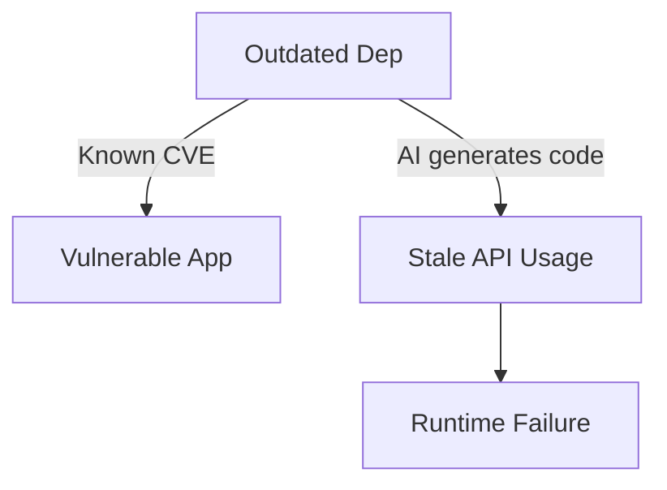

</v-click>

<!--
Dependency management is the most undervalued security practice. It's also the easiest to automate.
-->

---

# Dependency Management — Tools

<div class="grid grid-cols-2 gap-6">
<div>

### CI Pipeline
<v-clicks>

- **Renovate** — automated PRs, configurable release age, supports 100+ package managers
- **Dependabot** — GitHub-native, zero-setup, simpler but less configurable

</v-clicks>
</div>
<div>

### Comparison
<v-clicks>

| Feature | Renovate | Dependabot |
|---------|----------|------------|
| Config | JSON/RE2 | YAML |
| Release age filter | Yes | No |
| Grouping | Advanced | Basic |
| Setup | Moderate | Zero |

</v-clicks>
</div>
</div>

<!--
Renovate if you want control. Dependabot if you want simplicity. Both are better than nothing.
-->

---
layout: default-note
---

# Concept — Repository Posture Assessment

<v-clicks>

- **What**: evaluating whether a repo follows security best practices
- **Why**: individual scans find vulns; posture finds **process gaps**
- **Examples**: branch protection off, unsigned commits, no CODEOWNERS

</v-clicks>

::note::

<v-click>

> A repo with SAST enabled but no branch protection is like a lock on a screen door.

</v-click>

<!--
Process gaps are harder to find than code vulns. That's why posture assessment exists.
-->

---
layout: default-note
---

# Posture Assessment — Tools

<div class="grid grid-cols-2 gap-6">
<div>

### CI (Scheduled)
<v-clicks>

- **OpenSSF Scorecard** — 18+ checks:
  - Branch protection
  - Signed commits
  - Pinned dependencies
  - Token permissions
  - Code review

</v-clicks>
</div>
<div>

### How to Run
<v-clicks>

- **GitHub Action**: scheduled workflow (weekly)
- **Not per-PR** — expensive but comprehensive
- **Output**: scorecard badge + detailed report

</v-clicks>
</div>
</div>

::note::

<v-click>

> Run weekly, not per-PR. Posture assessment is a **strategic** check, not a tactical one.

</v-click>

<!--
Scorecard tells you if your house has a foundation. Individual scans check if the walls are cracked.
-->

---
layout: center
class: text-center
---

# Deterministic > Non-Deterministic

<div class="text-xl opacity-80 mt-4">

"Soft prompts instruct. Hard constraints enforce."

</div>

<!--
This is the most important architectural principle in AI-native security.
-->

---
layout: default-note
---

# Deterministic > Non-Deterministic

<v-clicks>

- **Linters and type systems** are deterministic: same input → same output, every time
- **LLMs** are non-deterministic: same prompt → different output across sessions
- For security, **determinism is non-negotiable**

</v-clicks>

<v-click>

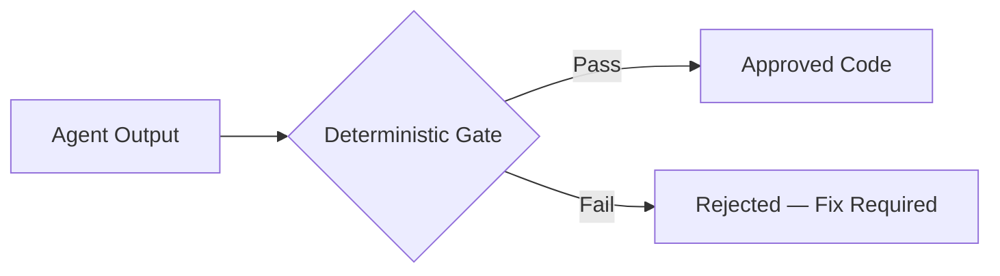

</v-click>

::note::

<v-click>

> **Implication**: hard constraints (ESLint, TypeScript strict, OPA) must be the backbone. AI adds context-aware reasoning on top, but can **never replace** the deterministic layer.

</v-click>

<!--
The LLM is the creative engine. The deterministic gate is the safety constraint. Never reverse them.
-->

---
layout: two-cols-header
---

# Concept — Infrastructure as Code (IaC) Scanning

::left::

<v-clicks>

- **What**: detecting misconfigurations in Terraform, CloudFormation, K8s manifests
- **Why**: cloud misconfigs are the **#1 cause** of data breaches
- **Scope**: IAM policies, network rules, encryption settings, logging

</v-clicks>

::right::

<v-click>

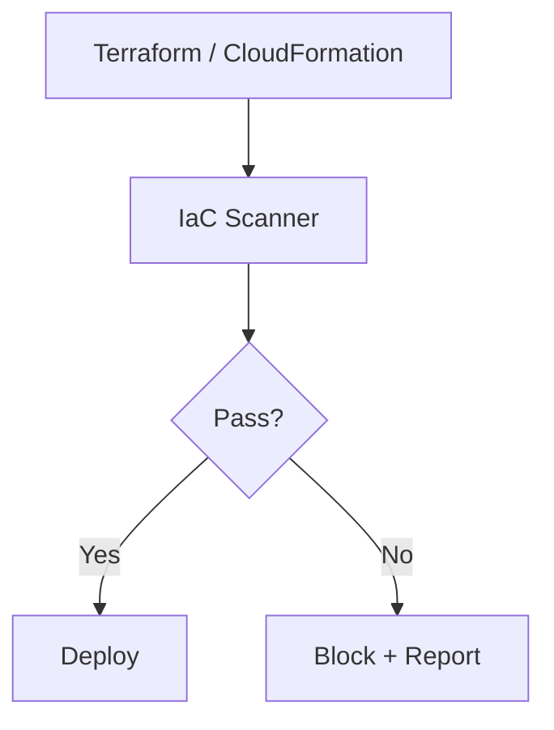

</v-click>

<!--
IaC scanning catches misconfigurations before they reach production. It's cheaper than a breach.
-->

---
layout: default-note
---

# IaC Scanning — Tools

<div class="grid grid-cols-2 gap-6">
<div>

### Local / IDE
<v-clicks>

- **Checkov** — 1000+ policies, Terraform/CloudFormation/ARM

</v-clicks>
</div>
<div>

### CI Pipeline
<v-clicks>

- **Checkov** — broadest scope
- **tfsec** — Terraform-specific, fast
- **Conftest** — OPA/Rego for IaC plans

</v-clicks>
</div>
</div>

::note::

<v-click>

> Checkov covers broadest scope. tfsec is Terraform-focused. Use Checkov for multi-cloud, tfsec for Terraform-only.

</v-click>

<!--
The tool choice depends on your IaC stack. Checkov is the safe default.
-->

---

# Concept — Container Scanning

<v-clicks>

- **What**: scanning container images for vulnerabilities and misconfigurations
- **Why**: containers bundle **OS packages + app deps**, both can be vulnerable
- **Scope**: base image CVEs, exposed secrets, excessive permissions

</v-clicks>

<!--
Containers are your deployment unit. If it's compromised, everything behind it is too.
-->

---
layout: default-note
---

# Container Scanning — Tools

<div class="grid grid-cols-2 gap-6">
<div>

### CI Pipeline
<v-clicks>

- **Trivy** — most popular, vulns + IaC + SBOM in one binary
- **Grype** — SBOM-native, 8 advisory sources

</v-clicks>
</div>
<div>

### Deploy
<v-clicks>

- **Admission controllers** — verify image signatures before pod creation

</v-clicks>
</div>
</div>

::note::

<v-click>

> **Note**: Trivy is multi-purpose. Grype is SBOM-native cross-check.

</v-click>

<!--
Trivy is the Swiss Army knife. Grype is the specialist. Layer them for depth.
-->

---

# Concept — Dynamic Application Security Testing (DAST)

<v-clicks>

- **What**: testing running application **from the outside**
- **Why**: finds runtime issues SAST can't:
  - Authentication flaws
  - Business logic errors
  - SSRF (Server-Side Request Forgery)

</v-clicks>

<v-click>

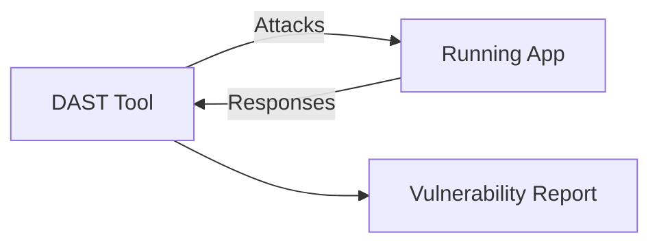

</v-click>

<!--
DAST is black-box testing. It doesn't see your code — it sees what an attacker sees.
-->

---
layout: default-note
---

# DAST — Tools

<div class="grid grid-cols-2 gap-6">
<div>

### CI / Staging
<v-clicks>

- **OWASP ZAP** — open-source, intercepting proxy, automated scanning
- **Burp Suite** — commercial, industry standard

</v-clicks>
</div>
<div>

### When to Use
<v-clicks>

- **Separate pipeline stage** — not inline with SAST/SCA
- **Requires running app** — staging environment needed
- **Best for**: auth flows, API endpoints, business logic

</v-clicks>
</div>
</div>

::note::

<v-click>

> DAST is typically a **separate pipeline stage**, not inline with SAST/SCA. It needs a running application.

</v-click>

<!--
DAST catches what SAST misses, and vice versa. They're complementary, not competing.
-->

---
layout: two-cols-header
---

# Concept — Policy Enforcement (Policy-as-Code)

::left::

<v-clicks>

- **What**: defining security rules as code, evaluated automatically
- **Why**: eliminates manual review bottlenecks, consistent enforcement across repos
- **Examples**: "no public S3 buckets", "all images must be signed", "no root containers"

</v-clicks>

::right::

<v-click>

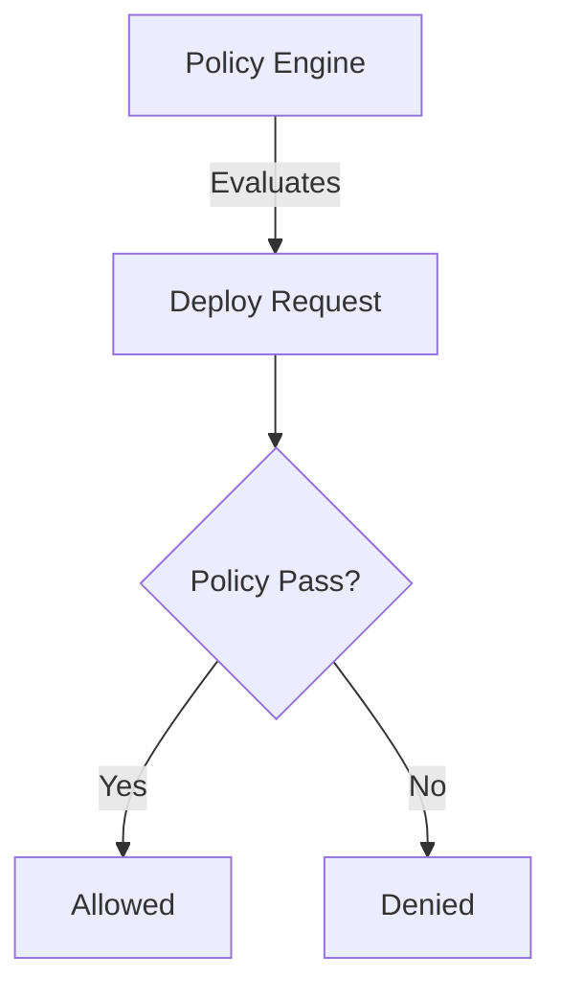

</v-click>

<!--
Policy-as-code turns security requirements into automated gates. No human bottleneck.
-->

---
layout: default-note
---

# Policy Enforcement — Tools

<div class="grid grid-cols-2 gap-6">
<div>

### CI / Deploy
<v-clicks>

- **OPA / Rego** — general-purpose, works across K8s, CI, API gateways
- **Conftest** — OPA specifically for IaC

</v-clicks>
</div>
<div>

### CI
<v-clicks>

- **Nx module boundary enforcement** — tag-based import rules (e.g., client can't import server code)

</v-clicks>
</div>
</div>

::note::

<v-click>

> OPA is the **industry standard** for policy-as-code. If you learn one policy engine, learn OPA.

</v-click>

<!--
OPA is the Kubernetes of policy engines. It's everywhere.
-->

---

# Concept — Artifact Signing & Provenance

<v-clicks>

- **What**: cryptographic proof that an artifact came from a specific pipeline and source
- **Why**: prevents tampering between build and deploy
- **Two complementary properties**:
  - **Provenance** — where did this come from? (SLSA)
  - **Integrity** — has it been modified? (Cosign)

</v-clicks>

<!--
Provenance and integrity are different questions. You need both.
-->

---
layout: default-note
---

# Artifact Signing — Tools

<div class="grid grid-cols-2 gap-6">
<div>

### Build
<v-clicks>

- **SLSA provenance attestation** — links artifact → build → commit
- Creates a verifiable chain from source to binary

</v-clicks>
</div>
<div>

### Deploy
<v-clicks>

- **Cosign / Sigstore** — keyless, OIDC-based, no key management
- Admission controllers verify signatures before deployment

</v-clicks>
</div>
</div>

::note::

<v-click>

> **SLSA proves provenance. Cosign proves integrity.** Both needed.

</v-click>

<!--
SLSA answers "where did this come from?" Cosign answers "is this the real thing?"
-->

---

# Concept — Runtime Security & Monitoring

<v-clicks>

- **What**: detecting anomalies in production
- **Why**: security doesn't stop at deploy
- **Scope**: syscall monitoring, network anomalies, behavioral analysis

</v-clicks>

<v-click>

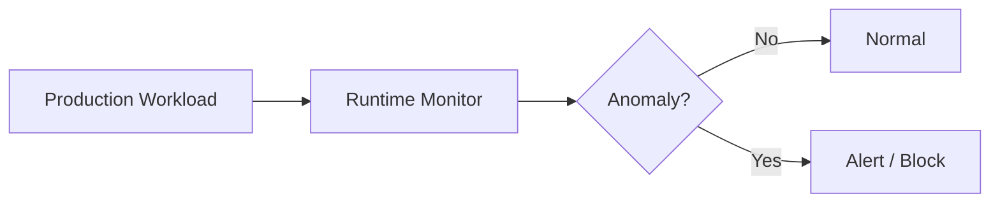

</v-click>

<!--
Runtime is your last line of defense. Everything before it should have already caught the issue.
-->

---
layout: default-note
---

# Runtime Security — Tools

<div class="grid grid-cols-2 gap-6">
<div>

### Runtime Monitoring
<v-clicks>

- **Falco** — syscall monitoring, anomaly detection, CNCF graduated

</v-clicks>
</div>
<div>

### Runtime (AI-Specific)
<v-clicks>

- **3-Gate Pattern** — PII detection → Sanitization → Injection scan for agent inputs

</v-clicks>
</div>
</div>

::note::

<v-click>

> Runtime is **outside CI/CD scope**. Separate systems, separate teams, same goal.

</v-click>

<!--
Runtime security is the boundary between "deployed" and "safe."
-->

---

# Section 3: AI-Native DevSecOps

<div class="text-xl opacity-80 mt-4">

How agents change the game — and how to keep them constrained

</div>

<!--
Now we shift from traditional DevSecOps to the AI-native layer. Same principles, new actors.
-->

---
layout: center
class: text-center
---

# The Agent Trust Problem

<div class="text-xl opacity-80 mt-4">

"Agents are fast but non-deterministic. Without constraints, one bad prompt → production breach."

</div>

<!--
This is the central tension of AI-native security.
-->

---
layout: two-cols-header
---

# The Agent Trust Problem

::left::

<v-clicks>

- Agents can **write code, run commands, modify infrastructure**
- They are **non-deterministic** — same prompt → different output
- Without constraints: one bad prompt → one bad commit → production breach
- The question is not "can agents write code?" but **"how do we constrain them?"**

</v-clicks>

::right::

<v-click>

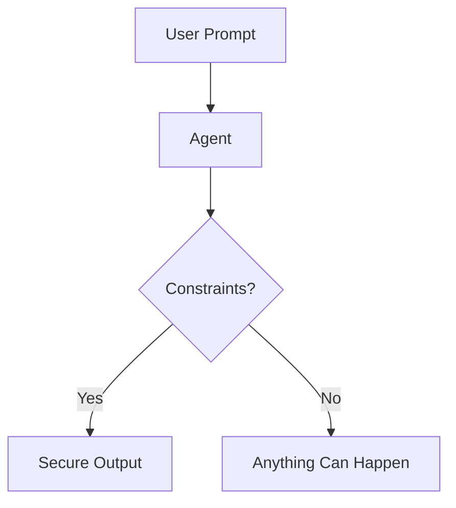

</v-click>

<!--
The agent is a powerful actor. Power without constraints is chaos.
-->

---

# What is an AI Agent (in SDLC context)

<v-clicks>

- **Not autocomplete**, not a chatbot
- **Autonomous actor**: reads files, runs commands, iterates based on feedback
- Participates in: **planning, coding, testing, review, documentation**
- Key difference from traditional tools: **reasoning capability + multi-step execution**

</v-clicks>


<v-click>

<div class="text-sm">

| Traditional Tool | AI Agent |
|-----------------|----------|
| Single task | Multi-step workflow |
| Deterministic | Non-deterministic |
| No reasoning | Context-aware reasoning |
| Fixed output | Adaptive output |

</div>

</v-click>

<!--
Understanding what agents ARE is critical to understanding why they need special controls.
-->

---
layout: two-cols-header
---

# Agent Harnesses — The Runtime Environment

::left::

<v-clicks>

- **What a harness provides**: tools, identity, context, constraints
- The harness is the **security boundary** around the agent
- Without a harness, the agent has the same access as the user who spawned it

</v-clicks>

::right::

<v-click>

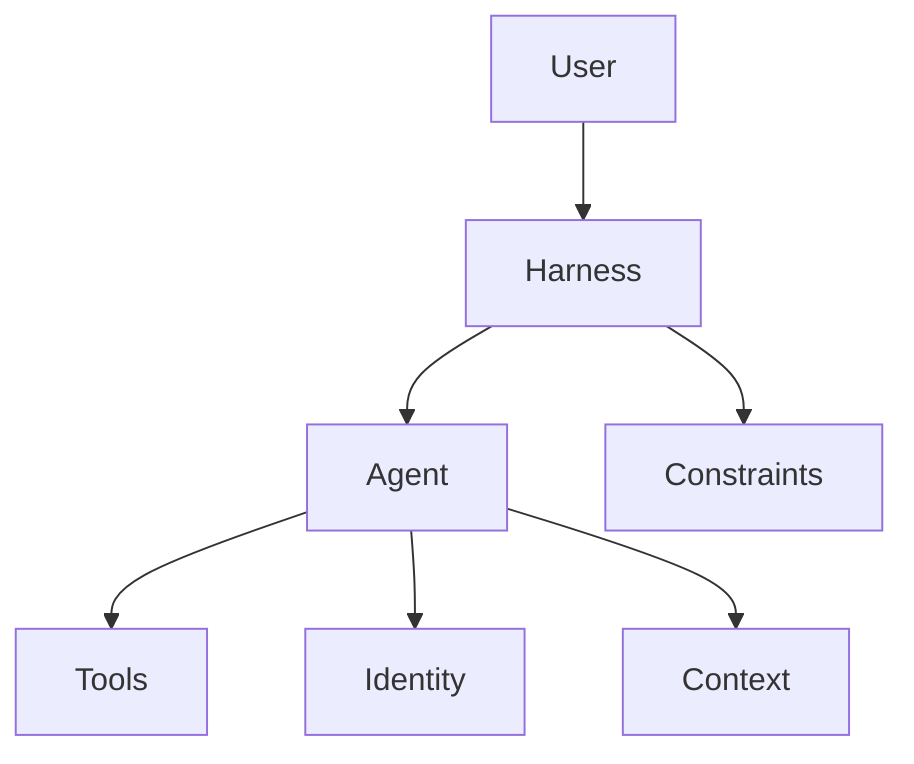

</v-click>

<!--
The harness is the agent's operating environment. It defines what the agent can and cannot do.
-->

---
layout: default-note
---

# Agent Harnesses — Config & Constraints

<v-clicks>

- **Config Bundles**: pre-loaded system prompts, allowed tools, safety guards
- **Constraint files**: `CLAUDE.md`, `.cursorrules`, `agents.md`
- **Purpose**: define what the agent **CAN** and **CANNOT** do

</v-clicks>

<v-click>

```
# Example: CLAUDE.md constraints
- Never run `rm -rf`
- Never modify `/libs/crypto/`
- Always run lint after edit
- Never commit without human review
```

</v-click>

::note::

<v-click>

> These are **hard constraints**, not suggestions. The harness enforces them.

</v-click>

<!--
Constraint files are the agent's "constitution." They must be specific, enforceable, and version-controlled.
-->

---
layout: center
class: text-center
---

# Secure-by-Design > Scan-and-Fix

<div class="text-xl opacity-80 mt-4">

Move security INTO the agent's constraints, not just AFTER its output

</div>

<!--
This is the architectural shift from traditional DevSecOps to AI-native DevSecOps.
-->

---
layout: default-note
---

# Why Prevention is Cheaper

<v-clicks>

- Scanning catches **known patterns**. Design prevents **entire categories**.
- Fixing vulns after generation is **expensive**. Preventing them is **free**.
- Deterministic gates (linters, type systems) are **cheaper** than SAST runs.

</v-clicks>

<v-click>

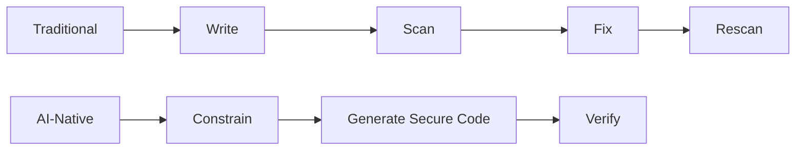

</v-click>

::note::

<v-click>

> The shift: move security **INTO** the agent's constraints, not just **AFTER** its output.

</v-click>

<!--
Every vulnerability you prevent at generation time is a vulnerability you never have to scan for, triage, or fix.
-->

---
layout: default-note
---

# The Two Layers

<div class="grid grid-cols-2 gap-6">
<div>

### Prevention Layer
<v-clicks>

- `CLAUDE.md` constraints
- TypeScript strict mode
- ESLint security rules
- OPA policy gates

</v-clicks>
</div>
<div>

### Verification Layer
<v-clicks>

- CodeQL (semantic analysis)
- Semgrep (pattern matching)
- Defense-in-depth, not primary defense

</v-clicks>
</div>
</div>

::note::

<v-click>

> Example: ESLint `no-eval` rule prevents eval injection. CodeQL catches what ESLint misses. 
> **Both needed, but prevention comes first.**

</v-click>

<!--
Layer 1 prevents. Layer 2 catches what Layer 1 misses. Never rely on just one.
-->

---
layout: two-cols-header
---

# Context Architecture — 3-Layer Instructions

::left::

<v-clicks>

- **System Layer**: base persona, safety rules (harness-level)
- **Project Layer**: tech stack, coding standards, security requirements (`CLAUDE.md`)
- **Task Layer**: immediate prompt or spec for current session

</v-clicks>

::right::

<v-click>

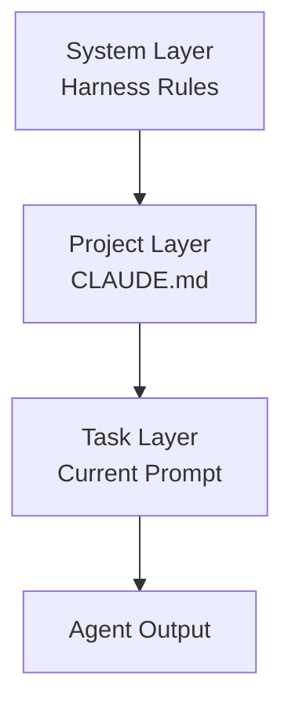

</v-click>

<!--
Each layer narrows the agent's behavior. Skip a layer, and the agent has too much freedom.
-->

---
layout: two-cols-header
---

# Spec-Driven vs Prompt-Driven Development

::left::

### Prompt-Driven
<v-clicks>

- Conversational, exploratory
- Fast for prototyping
- **Bad for security**
- Intent buried in chat history
- Hard to audit

</v-clicks>

::right::

### Spec-Driven
<v-clicks>

- Durable, version-controlled specs (`spec.md`)
- Agent treats spec as source of truth
- Implementation verified against spec via tests
- **Security requirements preserved**

</v-clicks>

<!--
Specs are code. Prompts are conversation. Code is reviewable. Conversation is not.
-->

---
layout: default-note
---

# The Non-Determinism Problem

<v-clicks>

- Same prompt → **different output** across sessions
- **Example**: Session A fixes SQL injection correctly. Session B uses insecure string-escape.
- **Impact**: inconsistent security posture, evades deterministic SAST rules

</v-clicks>

::note::

<v-click>

> **Mitigation**: deterministic gates (linters, type systems, OPA) **clamp agent output**

</v-click>

<!--
Non-determinism is the fundamental challenge. Deterministic gates are the answer.
-->

---
layout: two-cols-header
---

# MCP — Model Context Protocol

::left::

<v-clicks>

- **"USB-C for agents"**: unified interface for tool integration
- Created by Anthropic, **donated to Linux Foundation** (Dec 2025)
- Supported by: Anthropic, OpenAI, Google, Microsoft, GitHub, Cursor

</v-clicks>

::right::

<v-click>

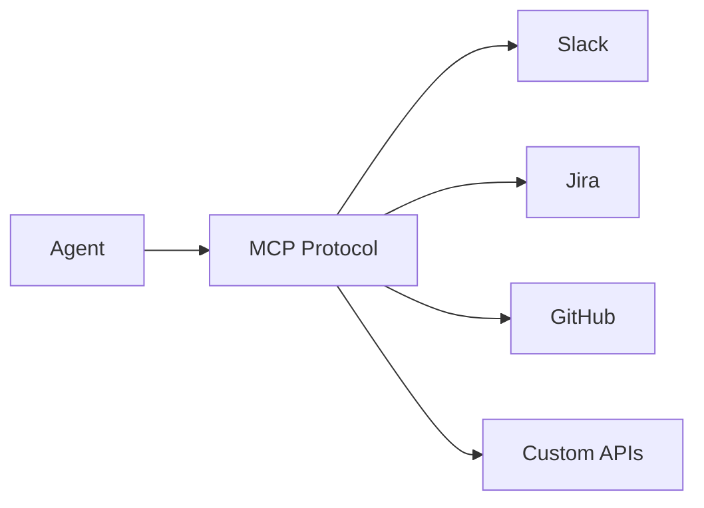

</v-click>


<!--
MCP is the standard for agent-tool communication. Like any standard, it has security implications.
-->

---
layout: default-note
---

# MCP Registries & Directories

<div class="grid grid-cols-2 gap-4 text-sm">
<div>

### Official & Curated
<v-clicks>

- **Official MCP Registry** — authoritative source, backed by Anthropic/GitHub/Microsoft. REST API for discovery.
- **Glama** — ~29,700 servers, curated with security scorecards, quality scoring, vulnerability checks. 

</v-clicks>
</div>
<div>

### Community
<v-clicks>

- **Smithery** — ~7-8k servers, package-manager approach, installability focus.
- **ClawHub** — OpenClaw's skill registry, ~10,700 skills.

</v-clicks>
</div>
</div>

::note::

<v-click>

> **ClawHavoc incident (2026)**: 341-1,184 malicious skills found in ClawHub with keyloggers, malware, exfiltration. Open publishing + no vetting = supply chain attack.

</v-click>

<!--
The ClawHavoc incident is the canonical example of what happens when you trust unvetted agent tools.
-->

---
layout: center
class: text-center
---

# Agents Need the Same Controls as Humans

<div class="text-xl opacity-80 mt-4">

"If a human can't bypass the gate, neither can the agent."

</div>

<!--
This is the governance principle. Let's see what it means in practice.
-->

---
layout: default-note
---

# Agents Need the Same Controls as Humans

<v-clicks>

- Human developers: constrained by branch protection, code review, CI gates
- AI agents: must be constrained by the **SAME controls**, plus additional ones

</v-clicks>

<v-click>

### Agent-Specific Controls
<v-clicks>

- **Unique identity** — separate service accounts, not shared human creds
- **Scoped tokens** — minimum permissions per task
- **Audit trail** — prompt → reasoning → action → approval
- **Deterministic gates** > soft prompts

</v-clicks>
</v-click>

::note::

<v-click>

> **Principle**: if a human can't bypass the gate, neither can the agent.

</v-click>

<!--
Agents are employees with superpowers. They need the same access controls, plus more.
-->

---
layout: two-cols-header
---

# AI Governance — Agent IAM

::left::

<v-clicks>

- **Unique Agent IDs**: separate service accounts, not shared human creds
- **Automatic logoff**: invalidate sessions after inactivity
- **Human-in-the-Loop (HITL)**: mandatory approval for privilege-elevating actions

</v-clicks>

::right::

<v-click>

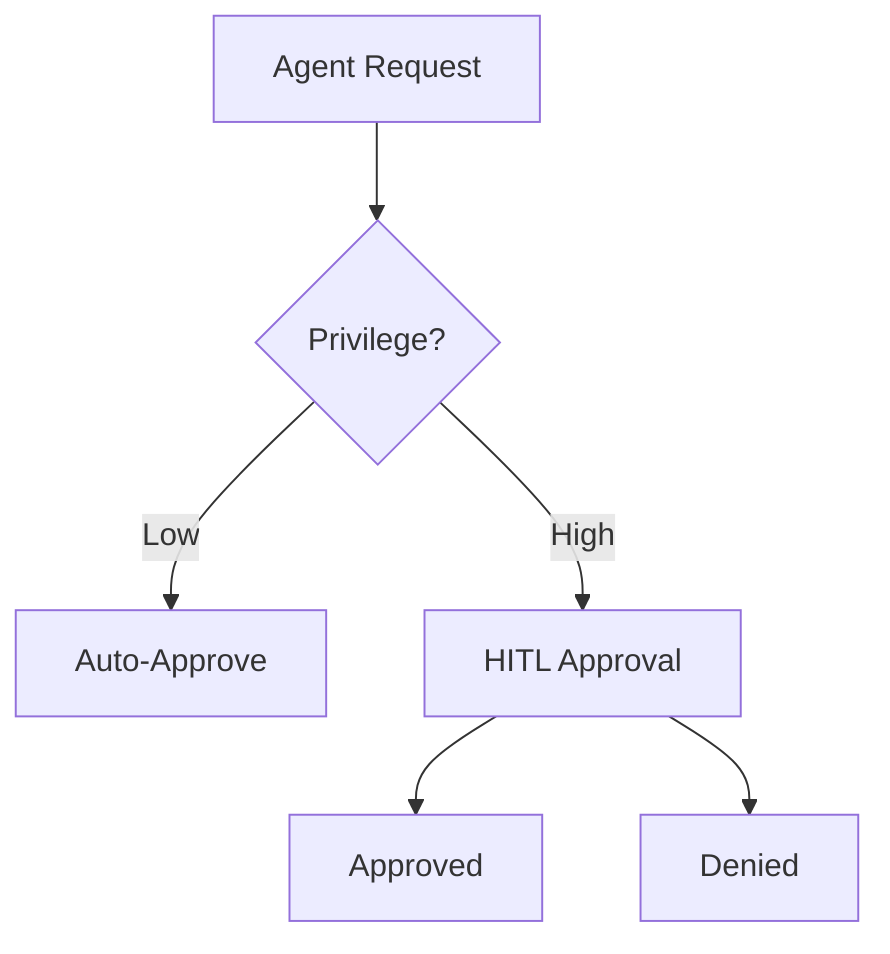

</v-click>

<!--
Agent IAM is the foundation of AI governance. No identity, no accountability.
-->

---
layout: default-note
---

# AI Governance — Audit Trail

<v-clicks>

- **Prompt logging**: capture all system/user prompts, immutable
- **Reasoning metadata**: chain of thought stored with PR
- **Commit labeling**: `Co-authored-by: Claude`, `ai-generated`, `ai-remediated`
- **Non-repudiation**: signed commits for all agent-originated changes

</v-clicks>

::note::

<v-click>

> If you can't prove **who** wrote the code and **why**, you can't trust the code.

</v-click>

<!--
Audit trail is non-negotiable. It's the difference between "the agent did it" and "we know exactly what the agent did and why."
-->

---
layout: default
---

# AI Governance — Policy-as-Code for Agents

<v-clicks class="text-base">

- **Auth/Crypto**: block agent modifications to security-critical code without human approval
- **Infrastructure**: prevent agents from modifying IAM/Security Groups unless task labeled
- **Tool Abuse**: disallow `rm -rf`, `curl` unless verified against allowlist
- Enforcement: **OPA/Rego gates**, MCP Gateway

</v-clicks>

<v-click>

```
# OPA/Rego example
deny[msg] {
  input.agent
  input.file.path contains "/libs/crypto/"
  not input.approval.human
  msg := "Agent cannot modify crypto code without human approval"
}
```

</v-click>

<!--
Policy-as-code for agents is the same as policy-as-code for humans, just with agent-specific rules.
-->

---
layout: default-note
---


# AI Governance — RAG Security

<v-clicks>

- **Permission-aware retrieval**: agents only see data they're authorized to access
- **Namespace isolation**: multi-tenant environments must isolate embedding namespaces
- **RAG Triad**: Context Relevance, Groundedness, Answer Relevance
- **Groundedness verification**: filter hallucinations before they reach output

</v-clicks>

::note::

<v-click>

> RAG is the agent's memory. If the memory is poisoned or leaked, the agent is compromised.

</v-click>

<!--
RAG is the agent's memory. If the memory is poisoned or leaked, the agent is compromised.
-->

---
layout: default-note
---

# Concept — Skills for AI Agents

<v-clicks>

- **What**: reusable, structured instructions that teach agents domain-specific workflows
- **Why**: agents need more than generic prompts — they need **expert knowledge**
- **Skill anatomy**: YAML frontmatter (name, description, domain, tags, framework mappings) + Markdown body (workflow, verification, prerequisites)
- Skills are **composable**: an agent can load multiple skills for a complex task

</v-clicks>

::note::

<v-click>

> Example: a "SAST" skill teaches the agent how to run Semgrep, interpret results, and file findings

</v-click>

<!--
Skills are the agent's expertise library. They turn a general-purpose agent into a specialist.
-->

---
layout: default-note
---

# Skill Directories & Libraries

<v-clicks>

- **Anthropic Cybersecurity Skills** — 754 open-source skills across 26 security domains
- **claude-cybersecurity** — single skill, spawns 8 parallel specialist agents for code audit
- **ruflo plugins** - ruflo-aidefence, ruflo-security-audit, ruflo-jujutsu, ruflo-testgen
- **ECC** —  large collection of general-purpose skills
- **anthropics/skills** - Anthropics' public directory for skills

</v-clicks>


::note::

<v-click>

> Skills are the **knowledge layer** that makes agents useful for security. Without skills, agents are just fast typists.

</v-click>

---
layout: section
---

# Section 4: Pipeline Assembly

Putting it all together into a working pipeline

<!--
Now we assemble all these concepts into a real pipeline.
-->

---
layout: two-cols-header
---

# The Pipeline — Station Overview

::left::

<v-click>

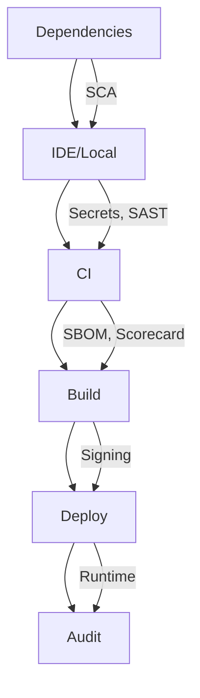

</v-click>

::right::

<v-clicks>

- Each station adds a **security control**
- Product can't leave a station without **passing inspection**
- Dependencies → IDE → CI → Build → Deploy → Audit

</v-clicks>

<!--
Think of the pipeline as a factory assembly line. Each station inspects and hardens.
-->

---
layout: default-note
---

# The Pipeline — CI Order (9 Steps)

<v-clicks class="text-sm">

1. **Checkout** — get the code
2. **Dependency Review** — check for known vulns
3. **OWASP Dep-Check** — fail at CVSS ≥ 7.0
4. **Renovate** — automated dependency updates
5. **Secret Scanning** — regex + entropy detection
6. **SAST** — CodeQL / Semgrep
7. **OpenSSF Scorecard** — repository posture
8. **Agentic Security Audit** — AI review
9. **SBOM + Policy Gate** — final compliance check

</v-clicks>

::note::

<v-click>

> **Order matters**: dependency checks first (fast, cheap), SAST next (slower, deeper), agentic audit last (most expensive). reference: ministryofjustice/devsecops-actions

</v-click>

<!--
Fail fast, fail cheap. Dependency checks take seconds. SAST takes minutes. Agentic audit takes longer.
-->

---
layout: default-note
---

# Reference Implementation — What's Missing

<div class="grid grid-cols-2 gap-6 text-sm">
<div>

### Covered by devsecops-actions
<v-clicks>

- SCA (Dependency-Check, Renovate)
- SAST (CodeQL)
- Secrets (MOJ + TruffleHog)
- SBOM (Syft)
- Supply Chain (Safe-Chain)
- Posture (Scorecard)

</v-clicks>
</div>
<div>

### Not Covered (Gaps)
<v-clicks>

- **IaC Scanning** — Checkov, tfsec, Conftest
- **Container Scanning** — Trivy, Grype
- **DAST** — ZAP, Burp Suite
- **Policy Enforcement** — OPA/Rego
- **Artifact Signing** — Cosign/Sigstore
- **Runtime Security** — Falco, 3-Gate Pattern

</v-clicks>
</div>
</div>

::note::

<v-click>

> The reference implementation covers ~60% of the pipeline. The gaps are where **you** fill in based on your stack.

</v-click>

<!--
This is a real pipeline, not a theoretical one. It's been tested in production.
-->

---

# Concept — Monorepo Orchestration

<v-clicks>

- **What**: managing multiple projects in a single repository with shared tooling
- **Why**: shared code, consistent tooling, deep dependency analysis across services, better context for AI Agents
- **Challenge**: as codebase grows, running all tests/scans on every PR becomes **slow and expensive**

</v-clicks>

<v-click>

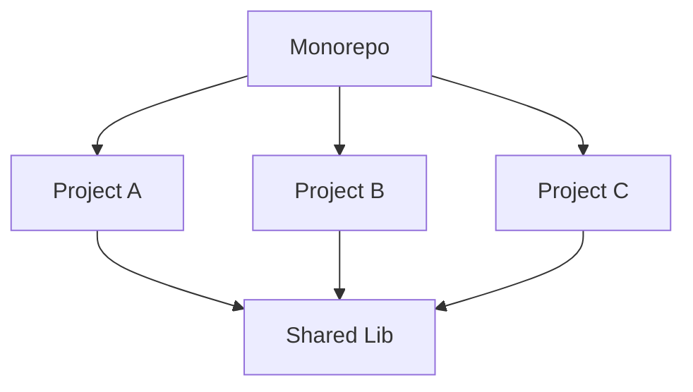

</v-click>

<!--
Monorepos are the norm for modern development. They need specialized tooling.
-->

---
layout: default
---


# Monorepo Orchestration — NX

<v-clicks class="text-sm">

- **Project Graph**: auto-discovers dependencies between projects
- **Affected Commands**: `nx affected -t test` — only scans projects impacted by a PR
- **Module Boundaries**: tag-based rules prevent illegal imports (e.g., client app importing server secrets)
- **Computation Hashing**: identical source + deps = identical build output (prevents build drift)

</v-clicks>

<v-click>

```
# Only test what changed
nx affected -t test lint build

# Enforce module boundaries
# nx.json
{
  "namedInputs": {
    "production": ["default", "!{projectRoot}/**/*_spec.ts"]
  }
}
```

</v-click>

<!--
Nx turns a slow monorepo into a fast one. Affected commands are the key optimization.
-->

---

# Concept — Self-Healing CI

<v-clicks>

- **What**: AI automatically detects and proposes fixes for CI failures
- **Why**: reduces "Time to Green" — no more manual PR babysitting for lint/format errors
- **Key insight**: deterministic failures (formatting, imports, lint) can be fixed automatically. **Security failures need human review.**

</v-clicks>

<!--
Self-healing CI is about reducing toil, not replacing judgment. Lint errors can be auto-fixed. Security issues cannot.
-->

---

# Self-Healing CI — Tools

<v-clicks>

### Nx Self-Healing CI

- `npx nx fix-ci` added to pipeline with `if: always()`
- AI analyzes failure using project graph context
- Proposes fixes as PR comments with diff views
- Auto-apply for deterministic checks (format, sync, conformance)
- Configurable via `.nx/SELF_HEALING.md`: off-limits areas, confidence rules

</v-clicks>

<v-click>

```
# .nx/SELF_HEALING.md
off-limits:
  - /libs/crypto/
  - /infra/
  - /security/
confidence-threshold: 0.95
```

</v-click>

<!--
Self-healing is powerful but must be constrained. Never auto-fix security-critical code.
-->

---
layout: section
---

# Section 5: Standards Deep-Dive

Mapping practices to industry standards

<!--
Standards are the "why" behind the "what." Let's see how our practices map.
-->

---

# OWASP Top 10 (2025) — Overview

<v-clicks>

- Updated annually, reflects current threat landscape
- Each item maps to **pipeline station + tool**
- The "what to protect against" for application security

</v-clicks>

<!--
OWASP is the baseline. If you're not addressing these, you're not doing application security.
-->

---
layout: default-note
---

# OWASP Top 10 — A01 to A03

<v-clicks>

- **A01: Broken Access Control** → IAM, RBAC, principle of least privilege
- **A02: Cryptographic Failures** → TLS everywhere, KMS for key management
- **A03: Injection** → CodeQL (semantic), Semgrep (pattern), ZAP (runtime)

</v-clicks>

::note::

<v-click>

> Injection is the most common vuln class. CodeQL + Semgrep is the standard defense.

</v-click>

---
layout: default-note
---

# OWASP Top 10 — A04 to A06

<v-clicks>

- **A04: Insecure Design** → Threat modeling, STRIDE methodology
- **A05: Security Misconfiguration** → Checkov, CIS Benchmarks
- **A06: Vulnerable Components** → Trivy, Grype, Snyk, Renovate

</v-clicks>

::note::

<v-click>

> A04 is the hardest to fix — it's a design problem, not a code problem. Threat modeling is the answer.

</v-click>

---

# OWASP Top 10 — A07 to A10

<v-clicks>

- **A07: Authentication Failures** → IAM scanners, MFA enforcement
- **A08: Software & Data Integrity Failures** → Cosign, SLSA
- **A09: Security Logging & Monitoring Failures** → SIEM, Sigma rules
- **A10: Server-Side Request Forgery (SSRF)** → ZAP, URL allowlisting

</v-clicks>

<!--
A08 is where supply chain security meets application security. SLSA + Cosign is the defense.
-->

---

# OWASP LLM Top 10 (2025) — Overview

<v-clicks>

- **First published 2025** — AI-specific risks
- Why traditional OWASP doesn't cover these:
  - Prompt injection ≠ SQL injection
  - Hallucination ≠ logic error
  - Model poisoning ≠ dependency confusion

</v-clicks>

<!--
LLM security is a new domain. The traditional OWASP categories don't map cleanly.
-->

---
layout: default-note
---

# OWASP LLM Top 10 — LLM01 to LLM03

<v-clicks>

- **LLM01: Prompt Injection** → 3-Gate Pattern (PII → Sanitize → Injection scan), input sanitization
- **LLM02: Sensitive Information Disclosure** → PII redaction, log filtering
- **LLM03: Supply Chain Vulnerabilities** → Slopsquatting, package age verification (Safe-Chain)

</v-clicks>

::note::

<v-click>

> Prompt injection is the SQL injection of the AI era. It's the #1 LLM risk.

</v-click>

---

# OWASP LLM Top 10 — LLM04 to LLM06

<v-clicks>

- **LLM04: Data & Model Poisoning** → training data validation, provenance tracking
- **LLM05: Improper Output Handling** → deterministic post-processing, output validation
- **LLM06: Excessive Agency** → scoped tokens, least privilege, HITL

</v-clicks>

<!--
LLM06 is the agent governance problem. Excessive agency = excessive risk.
-->

---
layout: default-note
---

# OWASP LLM Top 10 — LLM07 to LLM10

<v-clicks>

- **LLM07: System Prompt Leakage** → prompt isolation, never embed secrets in prompts
- **LLM08: Vector & Embedding Weaknesses** → permission-aware RAG, namespace isolation
- **LLM09: Misinformation** → groundedness verification, RAG Triad
- **LLM10: Unbounded Consumption** → rate limiting, Denial of Wallet prevention

</v-clicks>

::note::

<v-click>

> LLM10 is the operational risk. An unbounded agent can burn through your API budget in minutes.

</v-click>

---
layout: default-note
---

# SLSA Framework

<v-clicks>

- **Level 1**: Provenance — describe the build process
- **Level 2**: Signed Provenance — hosted build platform, signed attestation
- **Level 3**: Hardened Builds — non-falsifiable provenance, hermetic builds
- **Level 4**: Two-Party Review — mutually reviewed, auditable

</v-clicks>

::note::

<v-click>

> Most organizations should aim for **SLSA 3**. SLSA 4 is for high-security environments.

</v-click>

<!--
SLSA is the supply chain security maturity model. Start at Level 1, work your way up.
-->

---
layout: default-note
---

# SBOM Mandates & Formats

<div class="grid grid-cols-2 gap-6">
<div>

### Mandates
<v-clicks>

- **EO 14028** (US): SBOM required for federal software
- **EU CRA**: SBOM required for products sold in EU
- **Minimum elements**: supplier, component name, version, hash, dependencies

</v-clicks>
</div>
<div>

### Formats
<v-clicks class="text-sm">

| Feature | CycloneDX | SPDX |
|---------|-----------|------|
| Owner | OWASP | Linux Foundation |
| Focus | Security | Licensing |
| Vuln tracking | Yes | Limited |
| Adoption | Growing | Established |

</v-clicks>
</div>
</div>

::note::

<v-click>

> **Recommendation**: CycloneDX for security-focused orgs. SPDX for license-focused orgs.

</v-click>

<!--
SBOM mandates are becoming law. If you're not generating SBOMs, you'll be non-compliant soon.
-->

---
layout: default-note
---

# NIST CSF 2.0

<v-clicks>

- **Identify**: know what you have (asset management, risk assessment)
- **Protect**: implement safeguards (access control, training)
- **Detect**: find anomalies (continuous monitoring)
- **Respond**: take action (response planning, communications)
- **Recover**: restore operations (recovery planning, improvements)

</v-clicks>

<v-click>

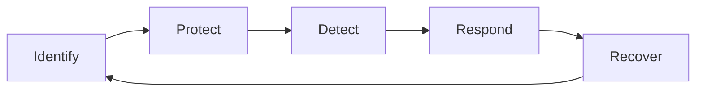

</v-click>

::note::

<v-click>

> **Mapped to pipeline**: Identify (SBOM) → Protect (SAST/SCA) → Detect (DAST/Runtime) → Respond (Alerts) → Recover (Rollback)

</v-click>

<!--
NIST CSF is the umbrella framework. Everything else maps into it.
-->

---
layout: section
---

# Section 6: Adoption & Closing

From theory to practice

<!--
Let's talk about how to actually implement all of this.
-->

---
layout: default
---

# Adoption Roadmap

<div class="grid grid-cols-3 gap-4">
<div>

### Foundation
<v-clicks>

- Pre-commit hooks (secrets)
- SAST in CI (Semgrep/CodeQL)
- SCA in CI (Dep-Check/Snyk)
- Basic branch protection

</v-clicks>
</div>
<div>

### Hardening
<v-clicks>

- SBOM generation (Syft)
- Artifact signing (Cosign)
- Policy gates (OPA)
- IaC scanning (Checkov)

</v-clicks>
</div>
<div>

### AI-Native
<v-clicks>

- Agent harnesses + constraints
- Agentic security audit
- Self-healing CI
- Agent IAM + audit trail

</v-clicks>
</div>
</div>

<!--
Adoption is a journey, not a destination. Start small, layer on complexity.
-->

---
layout: default
---

# Maturity Model (5 Levels)

<v-clicks>

| Level | Name | Characteristics |
|-------|------|----------------|
| **L1** | Ad-hoc | Manual reviews, no automation |
| **L2** | Repeatable | SAST/SCA in CI, pre-commit hooks |
| **L3** | Defined | Monorepo, SBOM, policy-as-code |
| **L4** | Managed | Agentic reviews, signed provenance |
| **L5** | Optimizing | Self-healing CI, autonomous remediation |

</v-clicks>

<!--
Be honest about your current level. The roadmap only works if you know where you're starting.
-->

---
layout: center
class: text-center
---

# Summary

<div class="grid grid-cols-2 gap-8 text-left mt-8">
<div>

### Key Takeaways
<v-clicks>

- Security must be **automated and continuous**
- Prevention > Detection
- Deterministic gates > Soft prompts
- Agents need the **same controls** as humans

</v-clicks>
</div>
<div>

### Next Steps
<v-clicks>

- Start with Foundation (pre-commit + SAST + SCA)
- Map your maturity level
- Build your first agent harness stack

</v-clicks>
</div>
</div>

<!--
Thank you. Questions?
-->

---
layout: center
class: text-center
---

# Q&A

<div class="text-xl opacity-80 mt-4">

Questions, challenges, and discussion

</div>

---
layout: section
---

# Appendix

Additional reference material

<!--
These slides are for reference. We won't cover them in the main presentation.
-->

---

# Appendix A: Regulatory Mapping

<div class="grid grid-cols-3 gap-4 text-sm">
<div>

### PCI DSS 4.0.1
<v-clicks>

- Req 6.2.3: secure development
- Req 6.2.4: security review
- Req 10.2.1: audit logs

</v-clicks>
</div>
<div>

### HIPAA §164.312
<v-clicks>

- Unique user ID
- Emergency access
- Transmission security

</v-clicks>
</div>
<div>

### GDPR Art. 25 & 32
<v-clicks>

- Privacy by design
- Data minimization
- 3-gate PII handling

</v-clicks>
</div>
</div>

<!--
Compliance is not optional. These regulations map directly to the practices we've discussed.
-->

---

# Appendix B: SBOM Risk Scoring

<v-clicks>

- **Component Risk Formula**: `risk = CVSS × exploitability × blast_radius`
- **Blast Radius Metrics**: number of dependents, deployment frequency, data sensitivity
- **Thresholds**: CVSS ≥ 7.0 = fail, blast radius > 50% = escalate

</v-clicks>

<v-click>

```
Component Risk = CVSS Score × EPSS Probability × Blast Radius Factor

Example:
  lodash (CVSS 7.5) × EPSS 0.12 × Blast Radius 0.8 = Risk 0.72
  → Auto-remediate (high confidence)
```

</v-click>

<!--
Risk scoring turns binary pass/fail into nuanced decisions.
-->

---

# Appendix C: Glossary

<div class="grid grid-cols-2 gap-4 text-xs">
<div>

- **SAST**: Static Application Security Testing
- **SCA**: Software Composition Analysis
- **DAST**: Dynamic Application Security Testing
- **SBOM**: Software Bill of Materials
- **SLSA**: Supply-chain Levels for Software Artifacts
- **OPA**: Open Policy Agent
- **MCP**: Model Context Protocol
- **RAG**: Retrieval-Augmented Generation
- **HITL**: Human-in-the-Loop

</div>
<div>

- **IAM**: Identity and Access Management
- **OIDC**: OpenID Connect
- **CVSS**: Common Vulnerability Scoring System
- **EPSS**: Exploit Prediction Scoring System
- **SSRF**: Server-Side Request Forgery
- **PII**: Personally Identifiable Information
- **CWE**: Common Weakness Enumeration
- **IaC**: Infrastructure as Code

</div>
</div>

<!--
Full definitions available in the source document.
-->
